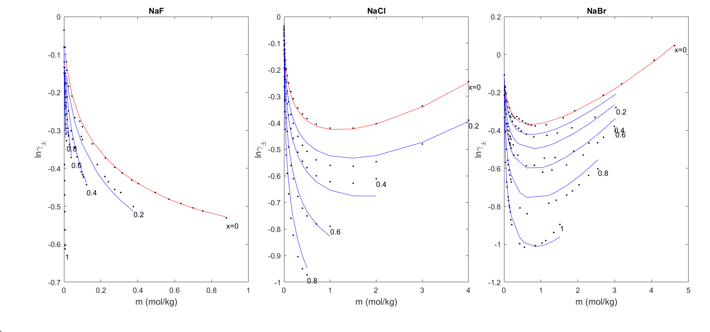

# Generalized Debye-Huckel Theory
## [2023 Paper: LSfit](https://www.sciencedirect.com/science/article/abs/pii/S0378381222002813)
### Chin-Lung Li, Shu-Yi Chou, Jinn-Liang Liu
#### Institute of Computational and Modeling Science, National Tsing Hua University, Hsinchu, Taiwan

#### Activity Coefficient

