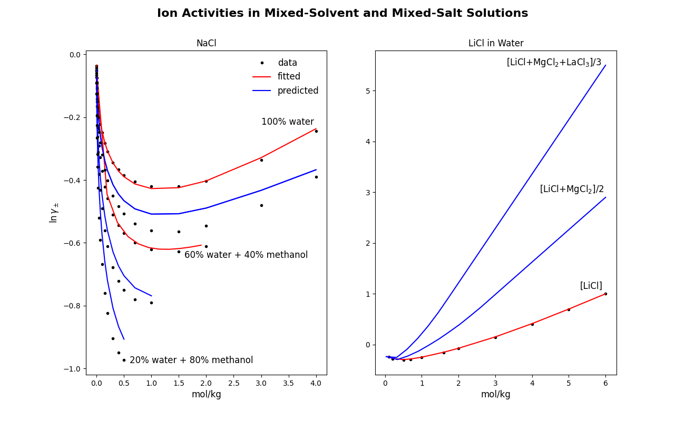
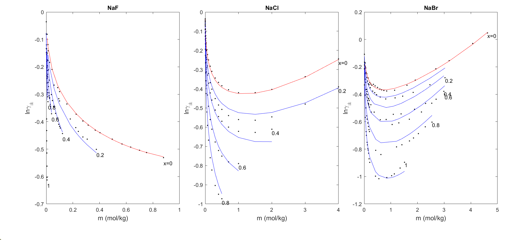

# Generalized Debye-Huckel Theory
## [2026 Paper: ACfitX Algorithm](https://pubs.acs.org/doi/pdf/10.1021/acs.jpcb.5c07754?ref=article_openPDF)
#### 
## [2023 Paper: LSfit Algorithm](https://www.sciencedirect.com/science/article/abs/pii/S0378381222002813) 
#### Ion Activities in Mixed-Solvent Solutions

